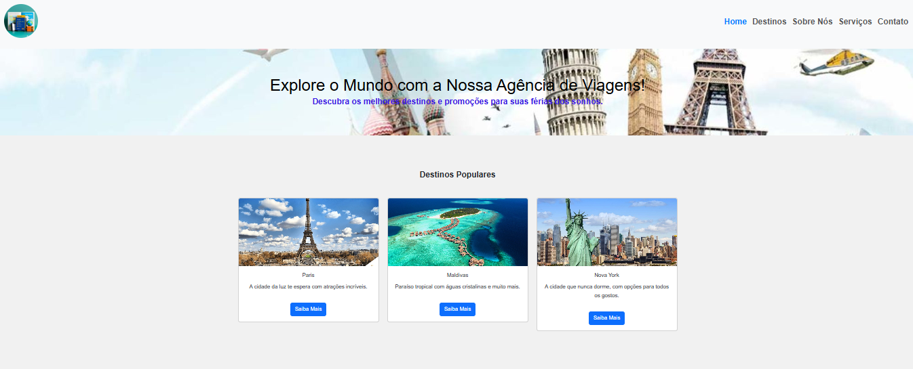

# Projeto Povos Indígenas - SQUAD - 25 
Um sistema web que representa um site de viagem e turismo a onde se compra pacotes de viagem completos e parciais.

* [Acesse o Repositório no GitHub](https://github.com/fisiofaz/AgenciaDeViagem)

* [Acesse Nosso Site](https://voarbemturismo.netlify.app/)

---

### **Equipe que atuou no projeto**: 
   * Fabio Andre Zatta - (3)
      - [Linkedin](https://www.linkedin.com/in/fabiozatta-dweb/)
      - [GitHub](https://github.com/fisiofaz)
  
  ---

### **Metodologia de Trabalho**  
**Metodologia Ágil**: Será adotado o **Scrum**, com sprints curtas e reuniões diárias (Daily Scrum) para acompanhar o progresso e ajustar o planejamento.  
- **Ferramenta de Gerenciamento**: Utilizar o Trello para acompanhar as tarefas, priorizar itens no backlog e monitorar o avanço do trabalho.  
- **Tecnologias Utilizadas**: HTML, CSS, Bootstrap e JS. 
- **Cronograma**: O projeto será dividido em três grandes etapas, com entregas incrementais para garantir qualidade e cumprimento dos prazos.  

---

### **Cronograma Geral**  

| **Fase**               | **Atividades Principais**                        | **Prazo**         |
|-------------------------|------------------------------------------------|-------------------|
| **1ª Semana** (15-21 jan) | - Compreensão do tema e definição do problema - Brainstorming e planejamento da solução - Estruturação inicial do banco de dados e protótipos do site | 21 jan (terça-feira)  |
| **2ª Semana** (22-28 jan) | - Design UX/UI Figma  - Desenvolvimento do front-end - Implementação do banco de dados - Testes iniciais | 28 jan (terça-feira)  |
| **Finalização** (29 jan - 7 fev) | - Validação do front-end - Ajustes finais - Documentação - Preparação da apresentação | 7 fev (domingo)   |

---

### **Plano Detalhado de Tarefas e Alocação**  

| **Tarefa**                                       | **Responsável**          |
|--------------------------------------------------|--------------------------|
| Estudo do tema e definição do problema           | Todos                    | 
| Planejamento inicial e brainstorming             | Todos                    | 
| Modelagem do banco de dados                      | Banco de Dados           | 
| Protótipo do front-end                           | Dedign UX/UI             |
| Criação do banco de dados                        | Banco de Dados           | 
| Desenvolvimento do front-end                     | Front-end                | 
| Testes e ajustes                                 | QA                       | 
| Criação de documentação (README, etc.)           | Documentação             |
| Gestão e Apoio                                   | Facilitador              | 
| Preparação e ensaio da apresentação              | Apreentação              | 

---

### **Ferramentas de Suporte** 
 
- **Desenvolvimento**: Visual Studio Code 
- **Versionamento de Código**: Git
- **Repositório Remoto**: GitHub
- **Modelagem de Banco de Dados**: BRModelo ou Diagrama Dia  
- **Apresentação**: Gamma.app
- **Deployment**: www.netlify.com
- **Imagens**: https://www.capcut.com/pt-br/create/avatar-maker

---

